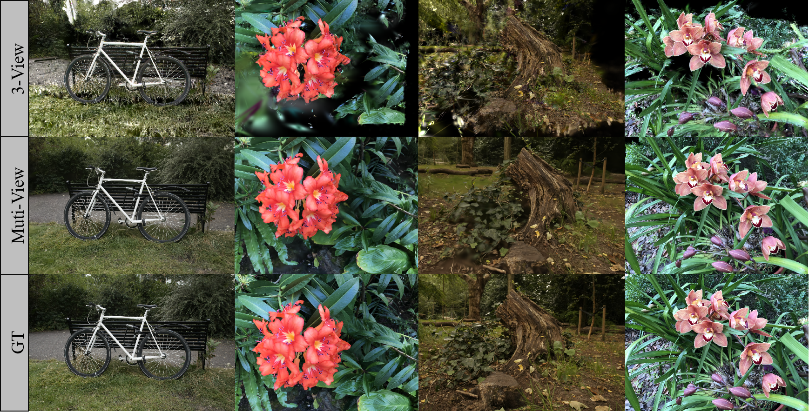
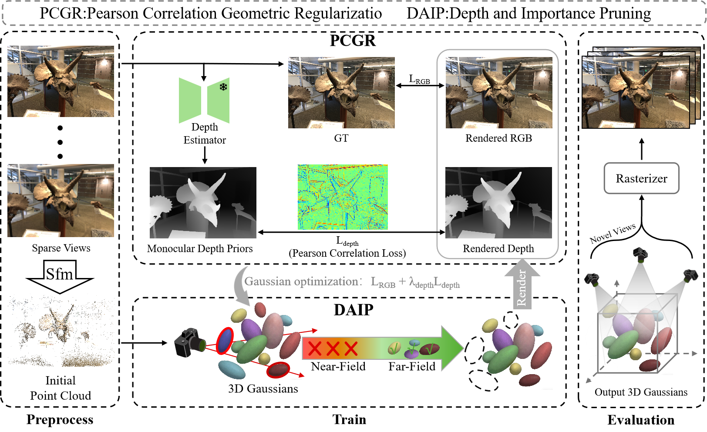
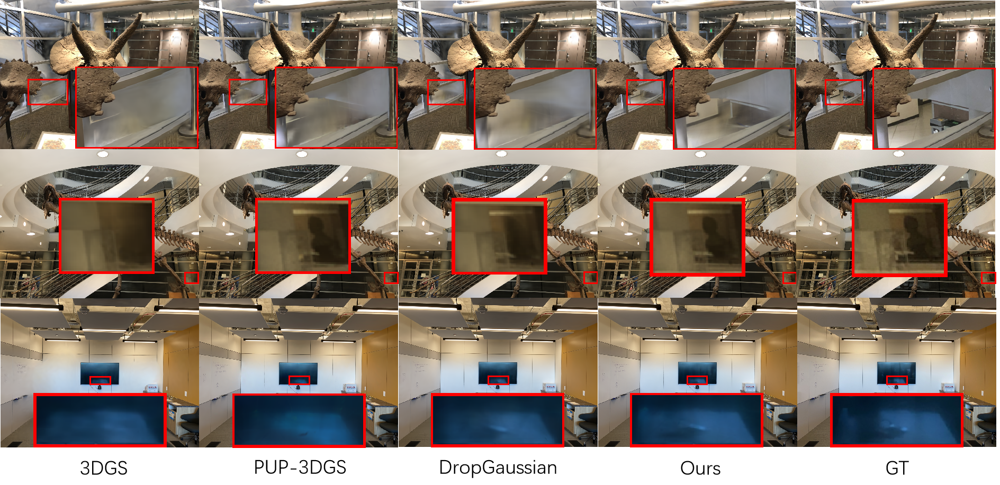

# Eliminating Visual Artifacts in 3D Gaussian Splatting for High-Fidelity Novel View Displays

<p align="center">
  
</p>

<p align="center">
  
  
</p>

---
---

## 📌 Status

> ⚠️ **Code is currently being prepared for public release.**
> It will be made publicly available upon paper acceptance / after the review process.

---

## 📌 News

- **[2026.04]** Paper submitted to *DISPLAYS* for review.

---

## Overview

<p align="center">
  
  <br>
  <em>Figure: Overview of the proposed dual-branch optimization framework.</em>
</p>

---


<p align="center">
  
  <br>
  <em>Qualitative comparisons on LLFF datasets.
  GD-GS eliminates floating artifacts and preserves distant background geometry.</em>
</p>


---

## Installation


### Requirements

- Python 3.8+
- CUDA 11.7+
- NVIDIA GPU (12GB+ recommended)

### Dependencies

```bash
# Clone the repository
git clone https://github.com/Argon314/GD-GS.git
cd GD-GS

# Create conda environment
conda create -n gdgs python=3.9
conda activate gdgs

# Install PyTorch
pip install torch torchvision --index-url https://download.pytorch.org/whl/cu118

# Install dependencies
pip install -r requirements.txt

